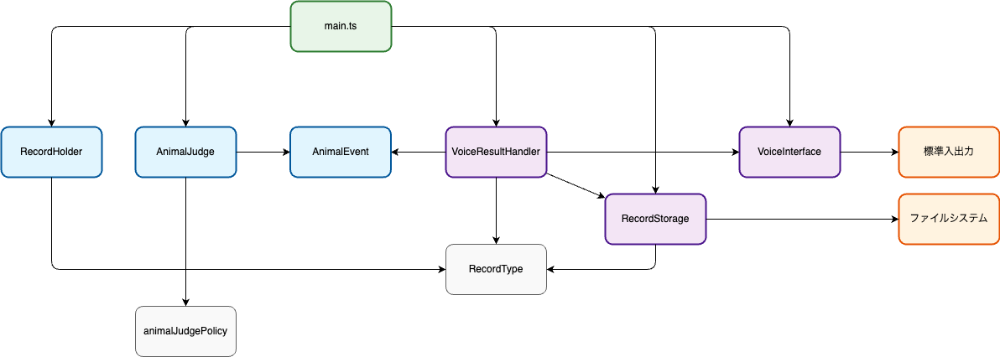

# TypeScriptで学ぶヘキサゴナルアーキテクチャ 〜リファクタリング実践記〜

## 1. はじめに

書籍 `単体テストの考え方/使い方` を読みました。  
この書籍の内容が非常に参考になったので、この書籍に書かれている考え方を実践したくなりました。

そこで、TypeScriptでサンプルコードを作成し、ヘキサゴナルアーキテクチャを意識したリファクタリングを行うことにしました。  
この記事では、本リファクタリングを通じて、ヘキサゴナルアーキテクチャの理解を深めることを目的としています。

## 2. サンプルコードの概要

サンプルコードは、動物の鳴き声を判定するアプリケーションです。
下記内容をインプットにして GitHub Copilot に初期実装を生成してもらいました。

`main.ts` に下記処理がすべてベタ書きされている状態です。

- 標準入力から文字列を受け取り、鳴き声を判定する。
- 判定結果に応じて、`record.json` ファイルの `dog`, `cat`, `unknown` の値を更新する。
- 判定結果が `unknown` の場合は、標準出力に「知らない鳴き声を受け取りました」と表示する。

```markdown
## 開発指示

### 概要

- 標準入力から文字列を受け付けるプログラムを作成してください。

### 要件

1. 標準入力から文字列を受け取る。
2. 入力が「ワン」の場合、`record.json` の `dog` の値を +1 する。
3. 入力が「ニャン」の場合、`record.json` の `cat` の値を +1 する。
4. 上記以外の文字列の場合、`record.json` の `unknown` の値を +1 し、「知らない鳴き声を受け取りました」と標準出力に表示する。
5. `record.json` が存在しない場合は、`dog`, `cat`, `unknown` を 0 で初期化する。

### 注意事項

- 入力受付後、`record.json` の内容を必ず保存すること。

### 例

- 入力: `ワン` → `record.json` の `dog` が +1
- 入力: `ニャン` → `record.json` の `cat` が +1
- 入力: `コケコッコー` → `record.json` の `unknown` が +1、「知らない鳴き声を受け取りました」と出力
```

そして、生成されたコードは以下の通りです。

```typescript
import * as fs from "node:fs";
import * as readline from "node:readline";

const RECORD_FILE = "./storage/record.json";

const rl = readline.createInterface({
  input: process.stdin,
  output: process.stdout,
});

let record: { dog: number; cat: number; unknown: number };
if (fs.existsSync(RECORD_FILE)) {
  const data = fs.readFileSync(RECORD_FILE, "utf-8");
  record = JSON.parse(data);
} else {
  record = { dog: 0, cat: 0, unknown: 0 };
}

rl.question("鳴き声を入力してください: ", (answer) => {
  const input = answer.trim();
  if (
    input === "ワン" ||
    input === "わんわん" ||
    input === "ワンワン" ||
    input === "わん"
  ) {
    record.dog += 1;
  } else if (
    input === "ニャン" ||
    input === "にゃん" ||
    input === "にゃんにゃん" ||
    input === "にゃーん"
  ) {
    record.cat += 1;
  } else {
    record.unknown += 1;
    console.log("知らない鳴き声を受け取りました");
  }
  fs.writeFileSync(RECORD_FILE, JSON.stringify(record, null, 2), "utf-8");
  rl.close();
});
```

## 3. 初期実装と課題

最初は`main.ts`に全ての処理（標準入出力、判定ロジック、ファイルI/O）が詰め込まれたモノリシックな実装です。  
この状態では、テストや拡張が困難で、責務が不明瞭という課題があります。

以降では、書籍 `単体テストの考え方/使い方` の考え方を紹介しながら、リファクタリングを進めていきます。

## 4. リファクタリング実行

### 4.1 依存関係の整理

本書では、アプリケーションが持ちうる依存を以下のように分類していました。

- 共有依存
- プライベート依存
- プロセス外依存

#### 共有依存

複数のテストケースが同一のリソースや状態を使い回すことで、あるテストの操作が別のテスト結果に影響を及ぼしてしまう依存。
例えば、  

- **データベースやファイルシステム**: テスト実行ごとに新規のインスタンスを作成できないため、状態がテスト間で共有される。
- **クラスの静的可変フィールド**: テスト間で値が保持されるため、あるテストの実行結果が別のテストに影響を与える。

#### プライベート依存

各テストケース内部で完結する依存。  
例えば、

- **モックやスタブ**: テストケース内でのみ使用され、他のテストに影響を与えない。
- **ローカル変数や関数**: テストケース内でのみ使用され、他のテストに影響を与えない。

#### プロセス外依存

アプリケーション (今回は`main.ts`) を実行するプロセスの外で稼働する依存。  
例えば、

- **データベース**: アプリケーションを実行するプロセスとは別、場合によっては別のサーバーで稼働する。
- **ファイルシステム**: OS のカーネルとドライバが管理するため、アプリケーションのメモリ空間とは別の領域で管理される。
- **外部API**: ネットワークを介して別プロセスにリクエストを送信し、レスポンスを受け取る。

#### 今回のモノリシックアプリにおける依存の分類

初期実装の`main.ts`を書籍の分類に当てはめて分析すると、以下の依存関係が存在しています：

##### ■ プロセス外依存

1. **ファイルシステム（`record.json`）**

   ```typescript
   // ファイルの存在確認
   if (fs.existsSync(RECORD_FILE)) {
     const data = fs.readFileSync(RECORD_FILE, "utf-8");
     record = JSON.parse(data);
   }
   
   // ファイルへの書き込み
   fs.writeFileSync(RECORD_FILE, JSON.stringify(record, null, 2), "utf-8");
   ```

2. **標準入出力（コンソール）**

   ```typescript
   // 標準入力
   const rl = readline.createInterface({
     input: process.stdin,
     output: process.stdout,
   });
   
   // 標準出力
   console.log("知らない鳴き声を受け取りました");
   ```

##### ■ 共有依存

1. **ファイルシステムの状態**

   - `record.json`ファイルの内容は複数のテスト実行間で共有される
   - あるテストで変更したファイル内容が、次のテストに影響を与える可能性

>ファイルシステムは「プロセス外依存」と「共有依存」の両方に分類されることに注意してください。
>
>- **プロセス外依存の観点**: OSのカーネルが管理する領域で、アプリケーションプロセスの外で稼働
>- **共有依存の観点**: ファイルの状態が複数のテスト間で共有され、テストの独立性を損なう
>
>一つの依存が複数の分類に該当することは珍しくありません。

##### ■ プライベート依存

1. **ローカル変数**

   ```typescript
   let record: { dog: number; cat: number; unknown: number };
   const input = answer.trim();
   ```

2. **判定ロジック（ハードコード）**

   ```typescript
   if (
     input === "ワン" ||
     input === "わんわん" ||
     input === "ワンワン" ||
     input === "わん"
   ) {
     record.dog += 1;
   }
   ```

#### 依存関係の問題点

##### プロセス外依存が多すぎる

- ファイルI/Oと標準入出力がビジネスロジックと密結合している
- テスト時にファイルシステムとコンソールに直接アクセスする必要がある

##### 共有依存による副作用

- ファイルの状態がテスト間で共有されるため、テストの独立性が失われる
- テストの実行順序に依存する脆弱なテストになりやすい

##### ビジネスロジックの埋没

- 鳴き声判定のルールがI/O処理と混在している
- 判定ルールの変更やテストが困難

### 4.2 ヘキサゴナルアーキテクチャによる依存関係の分離

ヘキサゴナルアーキテクチャ（ポートアンドアダプターアーキテクチャ）は、アプリケーションのコア（ドメインロジック）を外部の依存関係から分離することで、テスト可能性と保守性を向上させる設計パターンです。

本書では、以下のような観点でアーキテクチャを考えることが重要だと説明されています：

1. **プロセス外依存の特定と分離**
2. **ドメインロジックの純粋性の維持**
3. **依存関係の逆転による柔軟性の確保**

これらの考え方を実践するため、段階的にリファクタリングを進めていきます。

## 5. 段階的リファクタリングの実践

### 5.1 外部依存の切り出し

まず、プロセス外依存となる「標準入出力」と「ファイルI/O」を分離します。

#### 標準入出力の分離

```typescript
import * as readline from "node:readline";

export class VoiceInterface {
  hearVoice(prompt: string, callback: (input: string) => void): void {
    const rl = readline.createInterface({
      input: process.stdin,
      output: process.stdout,
    });
    rl.question(prompt, (answer) => {
      callback(answer.trim());
      rl.close();
    });
  }

  playSound(message: string): void {
    console.log(message);
  }
}
```

#### ファイルI/Oの分離

```typescript
import * as fs from "node:fs";

export type RecordType = { dog: number; cat: number; unknown: number };

export class RecordStorage {
  private filePath: string;

  constructor(filePath: string) {
    this.filePath = filePath;
  }

  // record.json に record を保存する
  save(record: RecordType): void {
    fs.writeFileSync(this.filePath, JSON.stringify(record, null, 2), "utf-8");
  }

  // record.json から record を読み込む
  load(): RecordType {
    if (fs.existsSync(this.filePath)) {
      const data = fs.readFileSync(this.filePath, "utf-8");
      return JSON.parse(data);
    }
    return { dog: 0, cat: 0, unknown: 0 };
  }
}
```

#### 分離後のmain.ts

外部依存を切り出した後の`main.ts`は以下のようになります：

```typescript
import { VoiceInterface } from "./voiceInterface";
import { RecordStorage } from "./recordStorage";

const voiceInterface = new VoiceInterface();
const recordStorage = new RecordStorage("./storage/record.json");

// record.json から既存のレコードを読み込み
let record = recordStorage.load();

voiceInterface.hearVoice("鳴き声を入力してください: ", (input: string) => {
  // 判定ロジック（まだ分離されていない）
  if (
    input === "ワン" ||
    input === "わんわん" ||
    input === "ワンワン" ||
    input === "わん"
  ) {
    record.dog += 1;
  } else if (
    input === "ニャン" ||
    input === "にゃん" ||
    input === "にゃんにゃん" ||
    input === "にゃーん"
  ) {
    record.cat += 1;
  } else {
    record.unknown += 1;
    voiceInterface.playSound("知らない鳴き声を受け取りました");
  }

  // レコードを保存
  recordStorage.save(record);
});
```

この分離により、`main.ts`から直接的なI/O処理が取り除かれ、依存関係が明確になりました。ただし、判定ロジックがまだ`main.ts`に残っているため、次のステップで分離していきます。

### 5.2 ドメインロジックの分離

次に、ビジネスロジックをドメイン層として分離します。

#### 動物判定ロジックの分離

```typescript
export enum AnimalEvent {
  Dog = "dog",
  Cat = "cat",
  Unknown = "unknown",
}

export class AnimalJudge {
  private judgeAnimal(input: string): AnimalEvent {
    if (
      input === "ワン" ||
      input === "わんわん" ||
      input === "ワンワン" ||
      input === "わん"
    ) {
      return AnimalEvent.Dog;
    } else if (
      input === "ニャン" ||
      input === "にゃん" ||
      input === "にゃんにゃん" ||
      input === "にゃーん"
    ) {
      return AnimalEvent.Cat;
    }
    return AnimalEvent.Unknown;
  }

  judge(input: string): AnimalEvent {
    return this.judgeAnimal(input);
  }
}
```

#### カウント更新ロジックの分離

```typescript
export type RecordType = { dog: number; cat: number; unknown: number };

// record.json に格納されているレコードを保持し、値をインクリメントする責務を担うクラス
export class RecordHolder {
  private record: RecordType;

  constructor(record: RecordType) {
    this.record = record;
  }

  increment(key: keyof RecordType): RecordType {
    return { ...this.record, [key]: this.record[key] + 1 };
  }
}
```

この段階で、データ構造の変更処理が純粋関数として実装され、副作用が排除されました。

### 5.3 結果処理の統合

アプリケーション全体の結果処理を統合するアダプター層を作成します。

#### VoiceResultHandlerクラスの責任

`VoiceResultHandler`は、**ドメイン層からの出力を受け取り、それに応じて外部システムへのアクションを実行する**責任を持ちます。

- **ドメイン層からの入力**: `AnimalEvent`（判定結果）と`RecordType`（更新後のレコード）
- **外部システムへのアクション**:
  - 判定結果が`Unknown`の場合、ユーザーへのメッセージ出力
  - レコードのファイルシステムへの永続化

これにより、ドメイン層は外部システムの詳細を知ることなく、純粋にビジネスロジックに集中できます。

```typescript
import { VoiceInterface } from "./voiceInterface";
import { RecordStorage, RecordType } from "./recordStorage";
import { AnimalEvent } from "./animalJudge";

export class VoiceResultHandler {
  constructor(
    private voiceInterface: VoiceInterface,
    private recordStorage: RecordStorage
  ) {}

  // ドメイン層からの結果を受け取り、外部システムへのアクションを実行
  handleResult(result: { record: RecordType; updatedAnimal: AnimalEvent }): void {
    // 判定結果に応じたユーザーフィードバック
    if (result.updatedAnimal === AnimalEvent.Unknown) {
      this.voiceInterface.playSound("知らない鳴き声を受け取りました");
    }
    
    // レコードの永続化
    this.recordStorage.save(result.record);
  }
}
```

### 5.4 責務の再分離

さらに細かい責務の分離を行い、判定とカウントの責務を明確に分けます。

### 5.5 ポリシーパターンの導入

判定ルールを外部化することで、拡張性とテスト容易性を向上させました。

```typescript
export type AnimalJudgePolicy = {
  [animal in AnimalEvent]?: string[];
};

export const animalJudgePolicy: AnimalJudgePolicy = {
  [AnimalEvent.Dog]: ["ワン", "わんわん", "ワンワン", "わん"],
  [AnimalEvent.Cat]: ["ニャン", "にゃん", "にゃんにゃん", "にゃーん"],
};
```

```typescript
export class AnimalJudge {
  private policy: AnimalJudgePolicy;

  constructor(policy: AnimalJudgePolicy) {
    this.policy = policy;
  }

  judge(input: string): AnimalEvent {
    for (const animal of Object.values(AnimalEvent)) {
      if (this.policy[animal]?.includes(input)) {
        return animal;
      }
    }
    return AnimalEvent.Unknown;
  }
}
```

### 5.6 最終的な依存関係の整理

最後に、各クラスが単一の責務を持つように最終調整を行います。

## 6. 最終的なアーキテクチャ

リファクタリング後のアーキテクチャは以下のようになります：

```typescript
import { AnimalJudge } from "./animalJudge";
import { animalJudgePolicy } from "./animalJudgePolicy";
import { RecordHolder } from "./recordHolder";
import { RecordStorage } from "./recordStorage";
import { VoiceInterface } from "./voiceInterface";
import { VoiceResultHandler } from "./voiceResultHandler";

// 依存関係の組み立て
const voiceInterface = new VoiceInterface();
const recordStorage = new RecordStorage("./storage/record.json");
const record = recordStorage.load();
const animalJudge = new AnimalJudge(animalJudgePolicy);
const recordHolder = new RecordHolder(record);
const voiceResultHandler = new VoiceResultHandler(
  voiceInterface,
  recordStorage
);

// アプリケーションの実行
voiceInterface.hearVoice("鳴き声を入力してください: ", (input: string) => {
  const animalEvent = animalJudge.judge(input);
  const updatedRecord = recordHolder.increment(animalEvent);
  voiceResultHandler.handleResult({
    record: updatedRecord,
    updatedAnimal: animalEvent,
  });
});
```

### クラス依存関係図

リファクタリング後の各クラスの依存関係は以下のようになります：



### 層別の責務

#### アプリケーション層 (緑色)

- `main.ts`: 依存関係の組み立てとアプリケーションの実行

#### ドメイン層（ビジネスロジック） (青色)

- `AnimalJudge`: 鳴き声から動物種別を判定
- `RecordHolder`: カウント数の更新処理
- `AnimalEvent`: 動物種別の列挙型

#### アダプター層（外部システムとの仲介） (紫色)

- `VoiceInterface`: 標準入出力の抽象化
- `RecordStorage`: ファイルシステムの抽象化
- `VoiceResultHandler`: ドメイン層の結果を外部システムへ反映

#### 設定・型定義 (灰色)

- `animalJudgePolicy`: 判定ルールの設定
- `RecordType`: レコード構造の型定義

### アーキテクチャの特徴

1. **ドメイン層の純粋性**
   - `AnimalJudge`と`RecordHolder`は外部依存を持たない
   - 単体テストが容易

2. **依存関係の逆転**
   - `AnimalJudge`は`AnimalJudgePolicy`に依存している
   - 鳴き声判定ルールの変更が容易になる

3. **明確な責務分離**
   - 各クラスが単一の責務を持つようになった
   - 変更の影響範囲が限定される

4. **プロセス外依存の隔離**
   - ファイルI/Oと標準入出力が分離された
   - モックによるテストが可能になった

## 7. まとめ

`単体テストの考え方/使い方` の考え方を実践することで、以下の改善が達成されました：

1. **テスト容易性の向上**: ドメインロジックが純粋関数として実装
2. **拡張性の確保**: ポリシーパターンによる設定の外部化
3. **保守性の向上**: 明確な責務分離による変更の局所化
4. **依存関係の整理**: ヘキサゴナルアーキテクチャによる構造の明確化

このリファクタリング過程を通じて、理論だけでなく実践的な経験として、良い設計とテスト可能性の関係性を深く理解することができました。

---

## 参考

- [単体テストの考え方/使い方](https://www.amazon.co.jp/%E5%8D%98%E4%BD%93%E3%83%86%E3%82%B9%E3%83%88%E3%81%AE%E8%80%83%E3%81%88%E6%96%B9-%E4%BD%BF%E3%81%84%E6%96%B9-Vladimir-Khorikov/dp/4839981728)
- [ヘキサゴナルアーキテクチャの基本概念](https://alistair.cockburn.us/hexagonal-architecture/)
